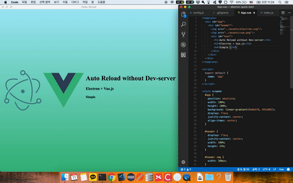

# electron-reload

**You can use it regardless of framework or language in Electron.**

This is the simplest way to load contents of all active BrowserWindows within electron when the source files are changed.



ex) Electron + Vue.js

## Requirements

**Use this app along with the [UDP / Datagram Sockets in Node.js API](https://nodejs.org/api/dgram.html#dgram_udp_datagram_sockets) and [Webpack plugin](https://github.com/webpack/docs/wiki/How-to-write-a-plugin)**

Electron-reload application needs just these files:

- `webpack.config.js` - Configuration file for module bundle
- `watch.webpack.config.js` - The apply method is called once by the Webpack compiler. File for it
- `main.js` - Starts the app and creates a browser window to render HTML. This is the app's **main process**.
- `index.html` - A web page to render. This is the app's **renderer process**.
- `index.js` - It is the starting point for using various modules. (vue, react, angular, etc..)

## Usage

To clone and run this repository you'll need [Git](https://git-scm.com) and [Node.js](https://nodejs.org/en/download/) (which comes with [npm](http://npmjs.com)) installed on your computer. From your command line:

```bash
# Clone this repository
git clone https://github.com/hotehrud/electron-reload
# Go into the repository
cd electron-reload
# Install dependencies
npm install
# watch for bundle file
npm run watch
# Run the app
npm start
```

